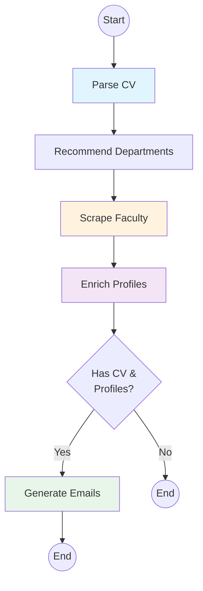

#  System Architecture

## Overview

The IIT KGP Internship Agent is a **multi-agent AI pipeline** built using LangGraph for orchestration. It processes student CVs, scrapes faculty data, and generates personalized outreach emails.

## High-Level Architecture

```
┌─────────────────────────────────────────────────────────────────────────────┐
│                              USER INTERFACE                                  │
│                           (CLI: src/main.py)                                │
└─────────────────────────────────────────┬───────────────────────────────────┘
                                          │
                                          ▼
┌─────────────────────────────────────────────────────────────────────────────┐
│                          LANGGRAPH WORKFLOW ENGINE                           │
│                         (src/graph/workflow.py)                              │
│  ┌─────────────────────────────────────────────────────────────────────┐    │
│  │                        AgentState (TypedDict)                        │    │
│  │  - cv_path, student_cv, faculty_profiles, enriched_profiles         │    │
│  │  - email_outputs, errors, logs, completed_steps                     │    │
│  └─────────────────────────────────────────────────────────────────────┘    │
└─────────────────────────────────────────┬───────────────────────────────────┘
                                          │
          ┌───────────────────────────────┼───────────────────────────────┐
          │                               │                               │
          ▼                               ▼                               ▼
┌─────────────────┐           ┌─────────────────┐           ┌─────────────────┐
│   AGENT 1       │           │    AGENT 2      │           │    AGENT 3      │
│  CV Parser      │───────────│ Faculty Scraper │───────────│  Enrichment     │
│                 │           │                 │           │                 │
│  Tools:         │           │  Tools:         │           │  Tools:         │
│  - PyMuPDF      │           │  - Playwright   │           │  - Serper API   │
│  - python-docx  │           │  - BeautifulSoup│           │  - aiohttp      │
│  - GPT-4o       │           │                 │           │                 │
└────────┬────────┘           └────────┬────────┘           └────────┬────────┘
         │                             │                             │
         │                             ▼                             │
         │                  ┌─────────────────┐                      │
         │                  │ Dept Recommender │                      │
         │                  │ (CV → CS, EC)    │                      │
         │                  └─────────────────┘                      │
         │                                                           │
         └─────────────────────────────┬─────────────────────────────┘
                                       │
                                       ▼
                           ┌─────────────────────┐
                           │      AGENT 4        │
                           │  Personalization    │
                           │                     │
                           │  Tools:             │
                           │  - GPT-4o           │
                           │  - Match scoring    │
                           └──────────┬──────────┘
                                      │
                                      ▼
                           ┌─────────────────────┐
                           │    JSON OUTPUT      │
                           │  generated_emails   │
                           └─────────────────────┘
```

## Workflow Graph



## Agent Details

### Agent 1: CV Parser (`src/agents/cv_parser.py`)

**Purpose**: Extract structured data from student CV

**Input**: PDF or DOCX file path

**Output**: `StudentCV` Pydantic model

**Process**:
1. Load document using PyMuPDF (PDF) or python-docx (DOCX)
2. Extract raw text (up to 8000 chars)
3. Send to GPT-4o with structured output schema
4. Parse response into `StudentCV` model
                    │                             │
         │                             ▼                             │
         │                  ┌─────────────────┐                      │
         │                  │ Dept Recommender │                      │
         │                  │ (CV → CS, EC)    │                      │
         │                  └─────────────────┘                      │
         │                                                           │
         └─────────────────────────────┬─────────────────────────────┘
                                       │
                                       ▼
                           ┌─────────────────────┐
                           │      AGENT 4        │
                           │  Personalization    │
                           │                     │
                           │  Tools:             │
                           │  - GPT-4o           │
                           │  - Match scoring    │
                           └──────────┬──────────┘
                                      │
                                      ▼
                           ┌─────────────────────┐
                           │    JSON OUTPUT      │
                           │  generated_emails   │
                           └─────────────────────┘
**Schema**:
```python
class StudentCV(BaseModel):
    student_name: str
    email: Optional[str]
    phone: Optional[str]
    university: str
    department: str
    cgpa: Optional[float]
    skills: SkillCategories
    projects: List[Project]
    internships: List[Internship]
    competitions: List[Competition]
    interests: List[str]
```

---

### Agent 2: Faculty Scraper (`src/agents/faculty_scraper.py`)

**Purpose**: Scrape faculty data from IIT KGP website

**Input**: List of department codes (CS, EC, EE, etc.)

**Output**: `List[FacultyProfile]`

**Process**:
1. Navigate to `/department/{CODE}` pages
2. Select "Faculty" from dropdown
3. Parse faculty cards using CSS selectors:
   - Name: `.hndg` span
   - Email: Regex for `@iitkgp.ac.in`
   - Designation: `.tx22 i`
   - Research: Text after "Research Area(s):"
4. Visit individual profile pages for additional data

**Department Code Mapping**:
```python
DEPARTMENT_CODES = {
    "Computer Science": "CS",
    "Electronics": "EC",
    "Electrical": "EE",
    "Mathematics": "MA",
    "Chemical": "CH",
    # ... more
}
```

---

### Agent 3: Research Enrichment (`src/agents/research_enrichment.py`)

**Purpose**: Enhance faculty profiles with web research

**Input**: `List[FacultyProfile]`

**Output**: `List[EnrichedProfile]`

**Process**:
1. For each professor, run 3 Serper searches:
   - `{name} IIT Kharagpur {department}`
   - `{name} publications research papers`
   - `{name} Google Scholar`
2. Extract relevant URLs, snippets
3. Calculate enrichment confidence (0.0-1.0)
4. Merge with profile data

**Serper API Integration**:
```python
async def search(query: str) -> List[Dict]:
    async with aiohttp.ClientSession() as session:
        response = await session.post(
            "https://google.serper.dev/search",
            headers={"X-API-KEY": api_key},
            json={"q": query, "num": 5}
        )
        return response.json()["organic"]
```

---

### Agent 4: Personalization (`src/agents/personalization.py`)

**Purpose**: Generate personalized outreach emails

**Input**: `StudentCV` + `List[EnrichedProfile]`

**Output**: `List[EmailOutput]`

**Process**:
1. Calculate match score based on:
   - Skill overlap (CV skills ↔ research areas)
   - Project relevance
   - Department alignment
2. Filter by minimum score threshold
3. Generate email using GPT-4o with:
   - Professor's research context
   - Student's relevant projects
   - Personalized hooks
4. Generate cover letter

**Match Score Calculation**:
```python
def calculate_match_score(cv: StudentCV, prof: EnrichedProfile) -> float:
    skill_overlap = len(set(cv.skills) & set(prof.research_areas))
    project_relevance = count_relevant_projects(cv.projects, prof)
    dept_match = 1.0 if cv.department == prof.department else 0.5
    return (skill_overlap * 0.4 + project_relevance * 0.4 + dept_match * 0.2)
```

---

## Data Flow

```
                    CV File (PDF/DOCX)
                           │
                           ▼
┌──────────────────────────────────────────────────────────────┐
│                     CV PARSER AGENT                           │
│  Input: /path/to/cv.pdf                                       │
│  Output: StudentCV {                                          │
│    name: "Harsh Bhatt",                                       │
│    skills: ["Python", "ML", "Blockchain"],                    │
│    projects: [DeepFake Detection, TradeGAN]                   │
│  }                                                            │
└──────────────────────────────────────────────────────────────┘
                           │
                           ▼
┌──────────────────────────────────────────────────────────────┐
│              DEPARTMENT RECOMMENDER                           │
│  Input: StudentCV                                             │
│  Output: ["CS", "EC", "EE", "MA", "CH"]                      │
│                                                               │
│  Mapping: ML → CS, EC | Blockchain → CS | Python → CS, EC    │
└──────────────────────────────────────────────────────────────┘
                           │
                           ▼
┌──────────────────────────────────────────────────────────────┐
│                   FACULTY SCRAPER AGENT                       │
│  Input: departments=["CS", "EC", ...]                         │
│  Output: List[FacultyProfile] × 188                           │
│                                                               │
│  Scrapes: /department/CS, /department/EC, ...                 │
│  Extracts: name, email, designation, research_areas           │
└──────────────────────────────────────────────────────────────┘
                           │
                           ▼
┌──────────────────────────────────────────────────────────────┐
│                  ENRICHMENT AGENT                             │
│  Input: List[FacultyProfile]                                  │
│  Output: List[EnrichedProfile]                                │
│                                                               │
│  Serper Queries:                                              │
│  - "Abhijnan Chakraborty IIT Kharagpur CS"                    │
│  - "Abhijnan Chakraborty publications"                        │
│  - "Abhijnan Chakraborty Google Scholar"                      │
└──────────────────────────────────────────────────────────────┘
                           │
                           ▼
┌──────────────────────────────────────────────────────────────┐
│                PERSONALIZATION AGENT                          │
│  Input: StudentCV + List[EnrichedProfile]                     │
│  Output: List[EmailOutput]                                    │
│                                                               │
│  For each professor:                                          │
│  1. Calculate match_score (0.0 - 1.0)                         │
│  2. Skip if score < min_threshold                             │
│  3. Generate personalized email via GPT-4o                    │
│  4. Generate cover letter                                     │
└──────────────────────────────────────────────────────────────┘
                           │
                           ▼
                   generated_emails.json
```

## State Management

The pipeline uses LangGraph's `TypedDict` for state management:

```python
class AgentState(TypedDict, total=False):
    # Input
    cv_path: Optional[str]
    faculty_url: str
    target_departments: Optional[List[str]]
    faculty_limit: Optional[int]
    min_match_score: float
    
    # Intermediate
    student_cv: Optional[StudentCV]
    faculty_profiles: List[FacultyProfile]
    enriched_profiles: List[EnrichedProfile]
    
    # Output
    email_outputs: List[EmailOutput]
    
    # Metadata
    current_step: str
    completed_steps: List[str]
    logs: List[str]
    errors: List[str]
```

## Error Handling

```
┌─────────────────────────────────────────────────────────────┐
│                     ERROR RECOVERY                           │
├─────────────────────────────────────────────────────────────┤
│                                                              │
│  CV Parsing Failed:                                          │
│  └── Return early with error, no emails generated            │
│                                                              │
│  Faculty Scraping Failed:                                    │
│  └── Log error, continue with empty profiles                 │
│                                                              │
│  Enrichment Failed:                                          │
│  └── Fall back to basic profiles (no enrichment)             │
│                                                              │
│  Email Generation Failed:                                    │
│  └── Skip professor, continue with others                    │
│                                                              │
│  Rate Limiting:                                               │
│  └── Tenacity retry with exponential backoff                 │
│                                                              │
└─────────────────────────────────────────────────────────────┘
```

## Technology Stack

| Component | Technology | Purpose |
|-----------|------------|---------|
| Orchestration | LangGraph | Agent workflow management |
| LLM | OpenAI GPT-4o | CV parsing, email generation |
| Web Scraping | Playwright | JavaScript-rendered pages |
| HTML Parsing | BeautifulSoup | Faculty card extraction |
| Web Search | Serper API | Research enrichment |
| Data Validation | Pydantic | Schema enforcement |
| Configuration | pydantic-settings | Environment management |
| Logging | structlog | Structured JSON logging |
| HTTP | aiohttp | Async HTTP requests |
| PDF | PyMuPDF | PDF text extraction |
| DOCX | python-docx | DOCX text extraction |

## Performance Characteristics

| Operation | Time | Notes |
|-----------|------|-------|
| CV Parsing | ~15s | GPT-4o structured output |
| Dept Scraping | ~5s each | 5 departments = 25s |
| Profile Scraping | ~4s each | 15 profiles = 60s |
| Enrichment | ~7s each | 3 Serper queries/prof |
| Email Generation | ~15s each | GPT-4o generation |
| **Total (15 profs)** | **~8 min** | End-to-end pipeline |

## Scalability Considerations

1. **Rate Limiting**: 
   - Serper: 2500 queries/month (free tier)
   - OpenAI: Pay-per-token
   - IIT KGP: 2s delay between requests

2. **Parallelization**:
   - Faculty scraping: Sequential (to avoid blocking)
   - Enrichment: Could be parallelized
   - Email generation: Sequential (API rate limits)

3. **Caching**:
   - Faculty profiles saved to `data/raw/`
   - Enriched profiles saved to `data/enriched/`
   - Can skip scraping on re-runs

## Security Notes

- API keys stored in `.env` (gitignored)
- No sensitive data in logs
- Professor emails extracted from public pages only
- Student CV data not persisted beyond runtime
